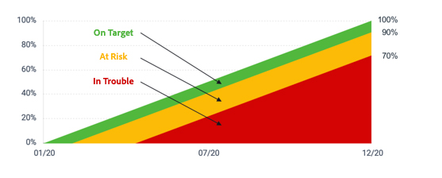

# Calcular progresso da meta

O [!DNL Workfront Goals] calcula o progresso da meta e exibe as seguintes informações:

* **Percentual real de conclusão**: o quanto da meta foi realmente concluído até o momento. Esse valor é uma média do percentual concluído de todos os indicadores de progresso associados à meta.
* **Percentual de conclusão esperado**: o quanto da meta deve estar concluído (neste momento) para que ela seja finalizada dentro do prazo. Este valor é calculado de acordo com a duração da meta (número total de dias) e o momento atual (número total de dias decorridos desde a data inicial da meta).
* **Progresso**: o progresso é um rótulo que indica se a meta está sendo concluída dentro do prazo ou se apresenta risco de não ser concluída a tempo.

![Uma captura de tela do progresso da meta no [!DNL Workfront Goals]](assets/13-workfront-goals-percent-complete.png)

O gráfico a seguir ilustra a relação entre os rótulos de progresso da meta e o percentual de progresso:

O progresso da meta permite ter uma ideia do quão perto ela está de ser concluída com base nas atualizações inseridas no sistema. Por isso é tão importante atualizar suas atividades e resultados nas Metas. Os rótulos de progresso ajudam a comunicar um status padronizado ao restante da organização.

![Um gráfico que cobre os diferentes rótulos de progresso no [!DNL Workfront Goals]](assets/15-workfront-goals-progress-bar-code.png)

>[!TIP]
>
>Para obter mais informações sobre as fórmulas usadas para calcular o progresso da meta, consulte este artigo: [Visão geral do progresso e condição das metas no Adobe Workfront Goals](https://experienceleague.adobe.com/docs/workfront/using/adobe-workfront-goals/goal-management/calculate-goal-progress.html?lang=pt-br#overview-of-goal-progress-and-threshold).

