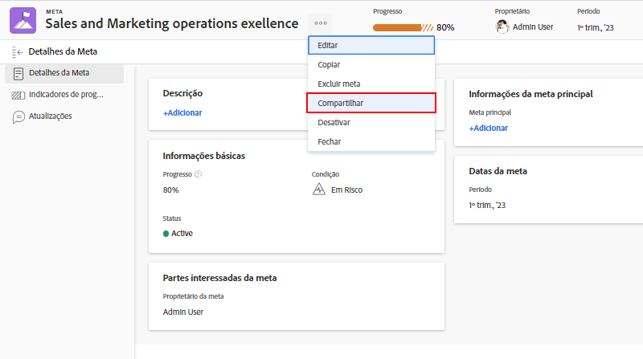

# Comunicar o status da meta

Agora que você atualizou suas metas usando [!UICONTROL Check-ins], dê um momento para retroceder e ter uma visão panorâmica das metas em que você está trabalhando e como elas se relacionam com as metas da equipe, grupo e empresa. Comunicar-se com outros sobre o progresso e o status dos seus objetivos é uma parte importante de se manter alinhado.

Há várias maneiras de manter as pessoas certas atualizadas sobre suas metas. Você pode começar por:

* Compartilhamento e criação de relatórios sobre suas metas
* Configurar a visualização do [!UICONTROL Pulso] fluxo para criar e exibir atualizações de meta individuais
* Aproveitamento da [!UICONTROL Gráficos] para obter um resumo abrangente do progresso de suas metas

## Compartilhar uma meta

Você pode compartilhar uma meta criada ou criada por outra pessoa para a qual tenha permissões para gerenciar. Não é possível compartilhar metas com grupos, equipes ou empresas. Se você tiver permissões de Gerenciamento para uma meta, poderá alterar as permissões da meta para o criador da meta. Por padrão, a pessoa que cria a meta tem permissões de Gerenciamento, mas você pode alterá-las para Exibir.

1. Clique no nome da meta para compartilhar de qualquer seção na [!DNL Goals] área a ser aberta [!UICONTROL Detalhes da meta] painel.

1. Clique no ícone de 3 pontos ao lado do nome da meta e clique em [!UICONTROL **Compartilhar**]. O [!UICONTROL Acesso à meta] será exibida.

   

1. Siga um destes procedimentos:

   * Selecione o [!UICONTROL Gerenciar todo o sistema] configuração para conceder permissões de gerenciamento a todos no sistema que tenham acesso ao Edit [!DNL Goals] através de [!DNL Workfront] nível de acesso. Isso é desmarcado por padrão para todas as novas metas.
   * Comece a digitar o nome de um usuário que deseja fornecer [!UICONTROL Gerenciar] permissões para no [!UICONTROL Conceder acesso ao Gerenciar] caixa. Selecione o nome quando ele aparecer na lista.

1. Clique em [!UICONTROL **Compartilhar**]. Um rótulo de &quot;Todo o sistema&quot; ou os nomes dos usuários que têm permissões de gerenciamento para a meta são exibidos no relatório [!UICONTROL Acesso ao Gerenciamento] no campo [!UICONTROL Detalhes da meta] painel.

## Relatório sobre informações de meta

Você pode criar relatórios de Meta ou relatórios de Projeto que incluem informações sobre metas associadas em [!DNL Workfront]. Há várias maneiras de visualizar informações de meta em relatórios.

* Crie um relatório de Meta na área Relatórios . Você pode exibir várias informações sobre a meta no relatório Meta (por exemplo: nome, proprietário, datas, progresso etc.), que inclui o seguinte:

   * **Hierarquia de Meta**—Exibe todas as metas principais e como elas se conectam umas às outras.
   * **É objetivo da empresa**—Indica se sua organização foi designada como proprietária de uma meta.
   * **Tipo de Proprietário**— Indica se o proprietário de uma meta é um usuário, equipe ou grupo.

* Crie um relatório de projeto que exiba informações de meta, incluindo o seguinte:
   * **Hierarquia de Meta**—Exibe todas as metas principais e como elas se conectam umas às outras.
   * **Metas**—Este é um campo de coleção que exibe todas as metas associadas a um projeto.
   * **Número de metas vinculadas**—O número de metas associadas ao projeto.
