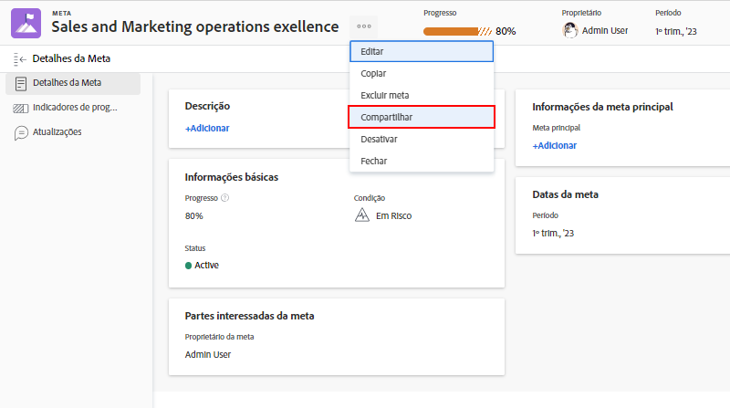

# Comunicar o status da meta

Agora que você atualizou suas metas, reserve um momento para dar um passo atrás e ter uma visão panorâmica das metas nas quais você está trabalhando e como elas se relacionam com os objetivos da equipe, do grupo e da empresa. Comunicar-se com outras pessoas sobre o progresso e o status de suas metas é uma parte importante para se manter alinhado.

Existem várias maneiras de manter as pessoas certas atualizadas sobre suas metas. Você pode começar ao:

* Compartilhar e relatar suas metas
* Uasr a seção [!UICONTROL Gráficos] para obter um resumo abrangente do progresso de suas metas

## Compartilhar uma meta

Você pode compartilhar uma meta que você criou ou uma meta criada por outra pessoa para a qual você tem permissão para gerenciar. Você não pode compartilhar metas com grupos, equipes ou empresas. Se você tiver permissões de gerenciamento para uma meta, poderá alterar as permissões da meta para o criador da meta. Por padrão, a pessoa que cria a meta tem permissões de gerenciamento, mas você pode alterá-las para visualização.

1. Clique no nome da meta para compartilhar em qualquer seção da área [!DNL Goals] para abrir o painel [!UICONTROL Detalhes da meta].

1. Clique no ícone de três pontos ao lado do nome da meta e clique em [!UICONTROL **Compartilhar**]. A caixa [!UICONTROL Acesso à meta] é exibida.

   

1. Siga um destes procedimentos:

   * Selecione a configuração [!UICONTROL Gerenciar todo o sistema] para conceder permissões de gerenciamento a todos no sistema que tenham acesso de edição para o [!DNL Goals] por meio do nível de acesso do [!DNL Workfront]. Esta opção fica desmarcada por padrão para todas as novas metas.
   * Comece a digitar o nome de um usuário ao qual você deseja conceder permissões de [!UICONTROL Gerenciamento] na caixa [!UICONTROL Conceder acesso de gerenciamento a]. Selecione o nome quando ele aparecer na lista.

1. Clique em [!UICONTROL **Compartilhar**]. Um rótulo “Em todo o sistema” ou os nomes dos usuários que têm permissões de gerenciamento para a meta são exibidos no campo [!UICONTROL Acesso para gerenciar] no painel [!UICONTROL Detalhes da meta].

## Relatório sobre informações da meta

Você pode criar relatórios de metas ou relatórios de projetos que incluam informações sobre metas associadas no[!DNL Workfront]. Há várias maneiras de exibir informações de meta em relatórios.

* Crie um relatório de metas na área Relatórios. Você pode exibir várias informações sobre a meta no Relatório de meta (por exemplo: nome, proprietário, datas, progresso etc.), que inclui o seguinte:

   * **Hierarquia de metas**: exibe todos os objetivos principais e como eles se conectam entre si.
   * **É a meta da empresa**: indica se sua organização foi designada como proprietária de uma meta.
   * **Tipo de proprietário**: indica se o proprietário de uma meta é um usuário, equipe ou grupo.

* Crie um relatório de projeto que exiba informações de metas, incluindo o seguinte:
   * **Hierarquia de metas**: exibe todos os objetivos principais e como eles se conectam entre si.
   * **Metas**: é um campo de coleção que exibe todas as metas associadas a um projeto.
   * **Número de metas vinculadas**: o número de metas associadas ao projeto.
