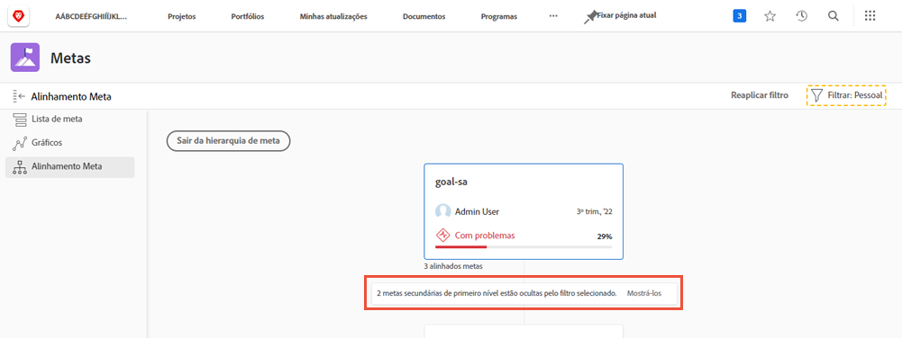

# Exibir atualizações de metas individuais

Neste vídeo, você aprenderá a:

* Veja suas metas individuais no fluxo de atualização do [!UICONTROL Pulse]

>[!VIDEO](https://video.tv.adobe.com/v/335200/?quality=12&learn=on)

## Filtre informações no seu fluxo do Pulse

Você pode perceber que às vezes você recebe muita informação no fluxo do [!UICONTROL Pulse] ou talvez não as informações corretas. Filtre as informações no feed para ver exatamente o que deseja ou precisa.

1. Clique em [!UICONTROL **Pulse**] no painel esquerdo.
1. Clique no ícone [!UICONTROL **Filtro**] no canto superior direito.
1. Selecione uma opção para filtrar. O filtro Todos é aplicado por padrão e exibe todas as metas no sistema. Você pode executar um dos seguintes procedimentos:

   * Selecione qualquer um dos filtros predefinidos, listados sob a seção [!UICONTROL Salvo] do painel de filtros, para exibir metas para proprietários (ou seja, [!UICONTROL Todos], [!UICONTROL Pessoal], [!UICONTROL Minhas equipes], [!UICONTROL Meus grupos] e [!UICONTROL Empresa]).
   * Passe o mouse sobre o nome de um filtro e clique no ícone **Editar** ao lado do nome para personalizá-lo e adicionar nomes específicos de usuários, equipes, grupos ou o nome da organização.
   * Clique em [!UICONTROL **Novo filtro**] para criar um novo filtro e, em seguida, selecione na lista de opções para personalizar e filtrar por [!UICONTROL Período], [!UICONTROL Status], [!UICONTROL Progresso] e/ou [!UICONTROL Proprietário].

   ![Imagem do painel de [!UICONTROL Filtros] no [!DNL Workfront Goals]](assets/18-workfront-goals-pulse-stream.png)

**Observação:** sua seleção de filtragem é preservada e as informações em outras seções do [!DNL Goals] são exibidas de acordo com essas informações. Você pode localizar e filtrar metas em várias seções da área [!DNL Goals] no [!DNL Workfront]:

* [!UICONTROL Lista de metas]
* [!UICONTROL Gráficos]
* [!UICONTROL Pulso]
* [!UICONTROL Alinhamento de metas]. Nesta seção, você pode exibir temporariamente as metas que não correspondem ao filtro aplicado para obter uma visão completa de todas as metas alinhadas. Clique na opção [!UICONTROL **Mostrá-la/Mostrá-las**] se houver metas ocultadas pelo filtro selecionado.

  
