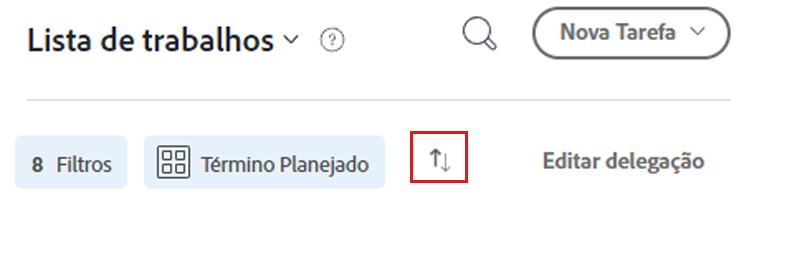

# Organizar sua lista de tarefas em [!DNL Workfront] [!UICONTROL Início]

>[!NOTE]
>
>A variável [!UICONTROL [!DNL Sort by]] opção no [!UICONTROL Lista de trabalho] foi renomeado para [!UICONTROL Agrupar por]e tarefas e problemas também podem ser agrupados por seus [!UICONTROL Data de Início Planejada].

Neste vídeo, você aprenderá a:

* Classificar atribuições de trabalho
* Filtrar atribuições de trabalho por tipo
* Identificar o trabalho que está pronto para começar
* Aceitar atribuições de trabalho

>[!VIDEO](https://video.tv.adobe.com/v/335099/?quality=12&learn=on)

>[!NOTE]
>
>Por padrão, os itens de vencimento mais antigos aparecem na parte superior do [!UICONTROL Lista de trabalho]. Se desejar que seus itens de trabalho sejam exibidos em ordem decrescente, clique nas setas à direita da área Agrupar por.

