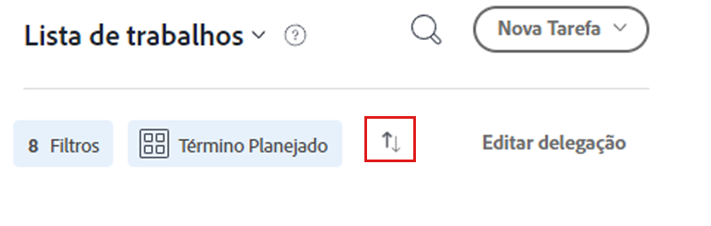

# Organizar sua lista de tarefas na [!UICONTROL página inicial] do [!DNL Workfront]

>[!NOTE]
>
>A opção [!UICONTROL [!DNL Sort by]] na [!UICONTROL Lista de trabalho] foi renomeada como [!UICONTROL Agrupar por], e tarefas e problemas também podem ser agrupados por sua [!UICONTROL Data inicial planejada].

Neste vídeo, você aprenderá a:

* Classificar atribuições de trabalho
* Filtrar atribuições de trabalho por tipo
* Identificar trabalhos que estão prontos para iniciar
* Aceitar atribuições de trabalho

>[!VIDEO](https://video.tv.adobe.com/v/335099/?quality=12&learn=on&enablevpops=1)

>[!NOTE]
>
>Por padrão, os itens com prazo mais próximo aparecem na parte superior da [!UICONTROL Lista de trabalho]. Se desejar que seus itens de trabalho sejam exibidos em ordem decrescente, clique nas setas à direita da área Agrupar por.

