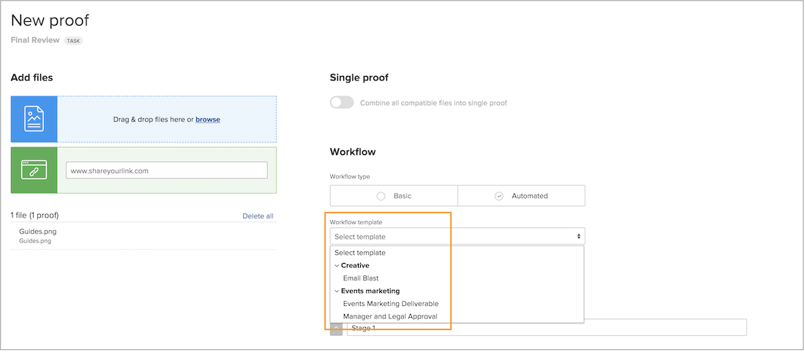
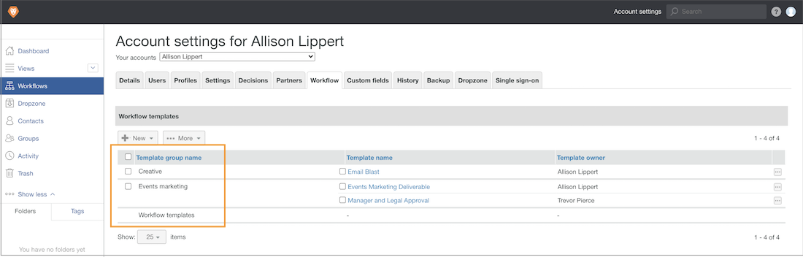

# Crie grupos de modelos para organizar modelos de fluxo de trabalho automatizados

Antes de começar a criar modelos de fluxo de trabalho automatizados, o [!DNL Workfront] recomenda que você crie grupos de modelos para ajudar a organizá-los. Grupos (pense neles como um compartimento para armazenar os vários modelos) são úteis quando há várias equipes ou departamentos usando provas, pois ajudam a manter os modelos organizados para que as pessoas que atribuem processos de revisão e aprovação saibam quais modelos usar.

Se ainda não tiver certeza de como deseja organizar os modelos em grupos, você poderá adicionar as informações de grupo posteriormente. No entanto, é mais fácil atribuir um grupo de modelos ao criar um modelo.

Você verá esses grupos não apenas nas configurações de prova, mas também quando for selecionar um modelo ao aplicar um fluxo de trabalho de prova. Os termos em negrito na lista de modelos são os grupos.

Os grupos de modelos são opcionais. Se a organização tiver apenas alguns modelos, talvez não seja necessário organizá-los em grupos.

**Para criar um grupo de modelos**

1. Selecione **[!UICONTROL Revisão]** no **[!UICONTROL Menu principal]** no [!DNL Workfront].
1. Selecione **[!UICONTROL Configurações da conta]** assim que a área de configurações de revisão for aberta.
1. Acesse **[!UICONTROL Workflows]** no menu do painel esquerdo.
1. Selecione **[!UICONTROL Novo grupo de modelos]** no botão **[!UICONTROL Novo]**.
1. Dê um nome para o grupo.
1. Clique fora do campo para salvar.

O novo grupo será exibido na lista.

## Excluir um grupo

Se você excluir um grupo que contém modelos, esses modelos serão preservados e movidos para um grupo genérico “[!UICONTROL Modelos de fluxo de trabalho]”. Você pode mover os modelos para outros grupos, se necessário.

<!--
Learn More Icon
Create and manage Automated Workflow templates
-->
