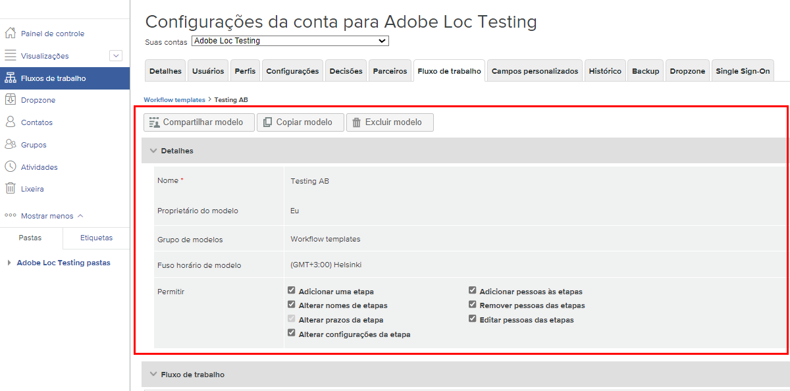

# Editar um modelo de fluxo de trabalho automatizado

À medida que os processos de revisão e aprovação de prova são melhorados ou recebem alterações organizacionais, os modelos automatizados de fluxo de trabalho devem ser atualizados para refletir as operações atuais das equipes que usam o Workfront.

Manter os modelos atualizados garante consistência nos processos de revisão e aprovação, além de economizar tempo no upload de provas, visto que não é necessário ajustar constantemente um fluxo de trabalho.

1. Selecione **[!UICONTROL Revisão]** no **[!UICONTROL Menu principal]** do [!DNL Workfront].
1. Em seguida, selecione **[!UICONTROL Fluxos de trabalho]** no menu do painel esquerdo.
1. Clique no menu de três pontos na extremidade direita do nome do modelo e selecione **[!UICONTROL Exibir detalhes do modelo]**.

As opções para compartilhar, copiar e excluir o modelo estão localizadas na parte superior da janela de detalhes de cada modelo. A exclusão de um modelo não afeta as provas em andamento que utilizam esse modelo, mas significa que o modelo não estará mais disponível para uso.

Clique na seta à esquerda da palavra “[!UICONTROL Detalhes]” para expandir ou recolher a seção.

## Faça alterações nos estágios e destinatários

Pode ser necessário fazer alterações na área do [!UICONTROL fluxo de trabalho] quando um processo simplificado gera um prazo mais curto ou quando alguém se junta à equipe para revisar provas.

Cada estágio de um fluxo de trabalho automatizado possui sua própria seção, o que permite que os prazos, a privacidade, os destinatários das provas e outras informações sejam modificadas de forma independente.

Este vídeo demonstra algumas das alterações que você pode fazer na área [!UICONTROL Fluxo de trabalho]. Consulte a lista com marcadores neste vídeo, que descreve essas configurações.

>[!VIDEO](https://video.tv.adobe.com/v/3432616/?quality=12&learn=on&enablevpops=1&captions=por_br)

Veja novamente as alterações do modelo de prova que você pode fazer na seção [!UICONTROL Fluxo de trabalho]:

* Clique no campo do nome do estágio ou no campo do prazo para atualizar essas informações.
* Clique na seta à esquerda do prazo para bloquear o estágio, determinar quando o estágio será ativado ou exigir apenas uma decisão.
* Na lista de destinatários, clique nos campos [!UICONTROL Função] ou [!UICONTROL Alertas de email] para selecionar outra opção.
* Use o menu de três pontos à direita do nome de um destinatário para excluí-lo da lista, torná-lo o principal tomador de decisões nesse estágio do fluxo de trabalho ou editar a função de prova e as informações de alerta por email.
* Você tem duas opções para adicionar destinatários à lista.
   1. No canto superior direito de cada seção do estágio, acesse o menu [!UICONTROL Mais] e selecione [!UICONTROL Adicionar pessoas ao estágio]. Depois de abrir a janela [!UICONTROL Adicionar pessoas ao estágio], clique no estágio ao qual deseja adicioná-las. Em seguida, insira o nome ou endereço de email na lista de destinatários e atribua uma função de prova e um alerta por email. Ao terminar, clique no botão [!UICONTROL Adicionar pessoas].
   1. Na parte superior da área [!UICONTROL Fluxo de trabalho], selecione [!UICONTROL Adicionar pessoas ao estágio].

## Compartilhamento de modelo

A área [!UICONTROL Compartilhado com] exibe os usuários de prova que podem usar o modelo. Remova as pessoas que não precisam mais usar o modelo clicando no menu de três pontos à direita do nome e selecionando [!UICONTROL Remover].

Lista ![[!UICONTROL Compartilhado com]](assets/proof-system-setups-edit-template-shared-with.png)

No entanto, não é possível adicionar pessoas à lista de compartilhamento nesta seção. Para fazer isso, volte à parte superior da janela de detalhes do modelo e clique no botão [!UICONTROL Compartilhar modelo].

## Informações adicionais

O [!DNL Workfront] mantém um histórico de auditoria de quando foram feitas alterações no modelo. É possível ver a data, quem fez a alteração e algumas informações breves sobre quais alterações foram feitas.

Esta seção não registra informações sobre quando o modelo foi usado em provas.

