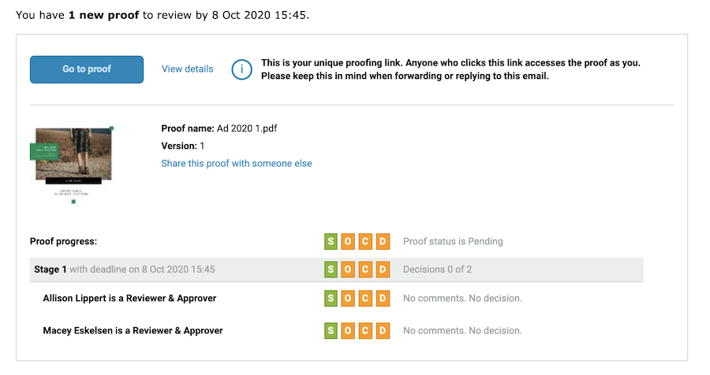
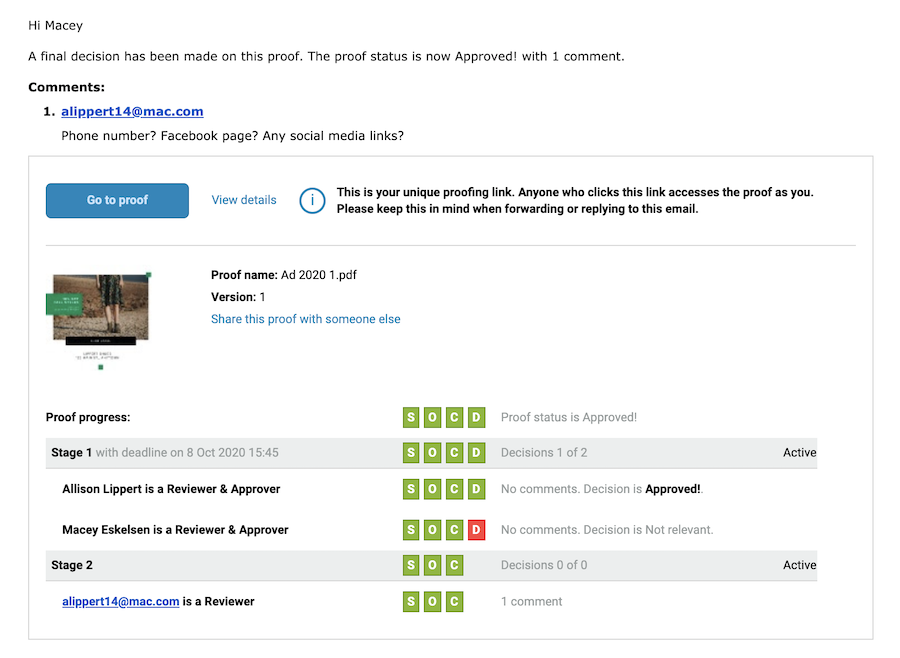

# Entenda sobre alertas de email e notificações de prova

Os alertas por email são diferentes dos emails de notificação de prova. Você receberá um email de notificação de prova quando receber uma nova prova para revisar, quando uma prova estiver atrasada ou quando houver uma nova versão para análise.

Se você desativar a opção de notificação ao enviar uma prova, ninguém receberá mensagens do [!DNL Workfront] informando que há uma nova prova para ser revisada.

Os alertas por email são definidos por revisor ou aprovador, geralmente, assim que a prova é carregada. Um tipo de alerta de email padrão pode ser atribuído aos destinatários, para que você não precise defini-lo sempre que fizer upload de uma prova. Converse com o(a) admin de sistema sobre como definir esses padrões.

Mesmo que os alertas por email estejam configurados como [!UICONTROL Desabilitado], os destinatários da prova ainda serão notificados sobre uma nova prova ou versão.

## Práticas recomendadas

| Prática recomendada | Saiba por quê |
|---|---|
| Desabilite a configuração “Enviar emails do Workfront quando um comentário for feito em uma prova” nas configurações do Workfront | Quando essa configuração está habilitada (por padrão), os usuários têm a possibilidade de receber diversas notificações por email para cada comentário em uma revisão, uma da funcionalidade de revisão e outra do próprio Workfront. Essas notificações duplicadas levam à interrupção e confusão das notificações por email, bem como a uma caixa de entrada de email cheia, o que pode fazer com que os usuários ignorem as notificações de revisão recebidas. Isso, por sua vez, pode resultar em prazos perdidos.    Observação: esta configuração do Workfront é encontrada em Menu principal > Configuração > Email > Revisão e aprovação. |

