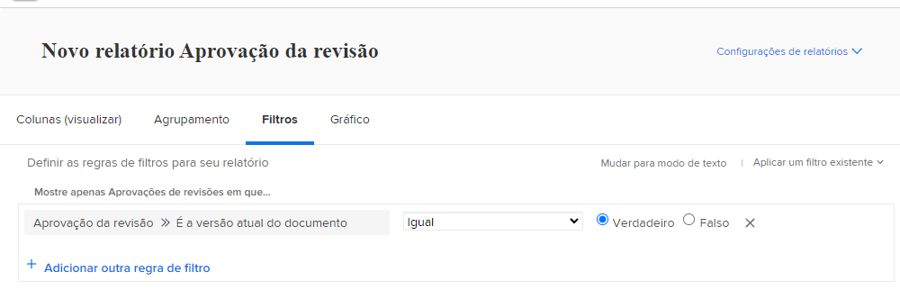
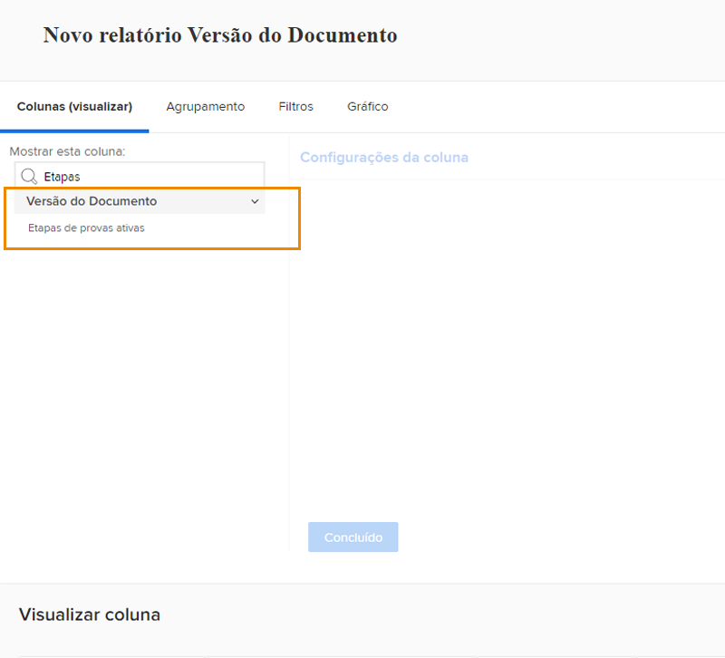
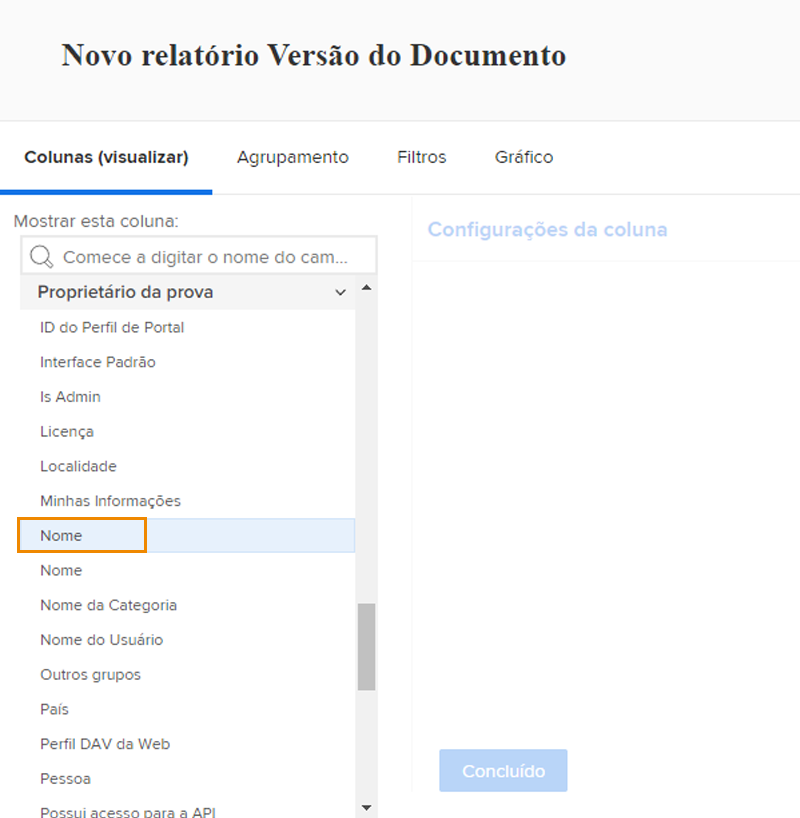

# Relatório sobre provas

[!DNL Workfront]Os recursos de prova digital do permitem gerenciar projetos e fluxos de trabalho de revisão relacionados em um único local — [!DNL Workfront]. Obtenha insights valiosos sobre o trabalho de prova que está sendo feito com tipos de relatório, fontes de campo e nomes de campo que exibem informações de revisão e aprovação.

Recomendamos trabalhar com o [!DNL Workfront] para criar relatórios que atendam aos requisitos de sua organização. Alguns relatórios exigem familiaridade com [!DNL Workfront]relatório do modo de texto do.

Comece com esses relatórios básicos e padrão para ajudar suas equipes a gerenciar provas em um processo de revisão e aprovação no [!DNL Workfront].

## [!UICONTROL Aprovação da revisão]

Este tipo de relatório ajuda você a rastrear aprovações de provas pendentes para garantir que os prazos estejam sendo cumpridos.

![Selecionar [!UICONTROL Aprovação da prova] do [!UICONTROL Novo Relatório] menu suspenso](assets/proof-system-setups-proof-approval-report.png)

As opções de exibição e filtro incluem [!UICONTROL data da decisão], [!UICONTROL aprovação de prova], [!UICONTROL estágio de aprovador], [!UICONTROL modelo de fluxo de trabalho], e [!UICONTROL informações do solicitante]. Com o relatório em modo de texto, você pode criar um agrupamento que organiza a lista por nome de documento. Consulte [Entender o modo de texto básico para agrupamentos](https://experienceleague.adobe.com/docs/workfront-learn/tutorials-workfront/reporting/intermediate-reporting/basic-text-mode-for-groupings.html?lang=en).

Ao escrever relatórios de aprovação de prova, verifique se você está obtendo informações relacionadas à versão mais recente das provas. [!DNL Workfront] A recomenda incluir esta origem de campo e nome de campo no filtro:

**[!UICONTROL Aprovação da prova]>>[!UICONTROL É a versão atual do documento]**

Isso é útil quando você está relatando provas que têm várias versões, de modo que o relatório lista somente a versão atual de cada prova que precisa de aprovação. Isso filtra as versões anteriores nas quais você não precisa mais trabalhar.

## [!UICONTROL Versão do Documento]

Esse tipo de relatório permite gerenciar e rastrear versões no [!DNL Workfront].

![Selecionar [!UICONTROL Versão do documento] do [!UICONTROL Novo Relatório] menu suspenso](assets/proof-system-setups-document-version-report.png)

As opções de exibição incluem informações do [!UICONTROL versão do documento], [!UICONTROL documento], [!UICONTROL digitado por], [!UICONTROL status de aprovação da prova], [!UICONTROL criador da prova], e [!UICONTROL provedor de documento].

Os agrupamentos podem ser feitos por [!UICONTROL versão do documento], [!UICONTROL digitado por], [!UICONTROL status de aprovação da prova]ou informações sobre o proprietário da prova.

Os filtros incluem [!UICONTROL versão do documento], [!UICONTROL nível de acesso], [!UICONTROL documento], [!UICONTROL digitado por], [!UICONTROL status de aprovação da prova], [!UICONTROL criador da prova]e informações do provedor de documentos.

Você pode exibir o nome do estágio de prova que está ativo no momento para cada documento no relatório com esta coluna em uma exibição:

**[!UICONTROL Versões do documento] >> [!UICONTROL Estágios de prova ativos]**

Se nenhum estágio estiver ativo no momento, a coluna ficará em branco.

Esta fonte de campo >> nome de campo também está disponível como um filtro em um relatório.

Use o [!UICONTROL Criador da prova] fonte do campo para relatar informações sobre o usuário que criou a prova. Escolha o [!UICONTROL Nome] fonte do campo para exibir o nome do criador da prova em uma visualização.

**[!UICONTROL Criador da prova] >> [!UICONTROL Nome]**

Essa combinação de fonte de campo >> nome do campo também está disponível como filtro.

<!--
Learn More Icon
Learn how to create reports in [!DNL Workfront] with the Report Creation class.
Access to proofing functionality
-->
