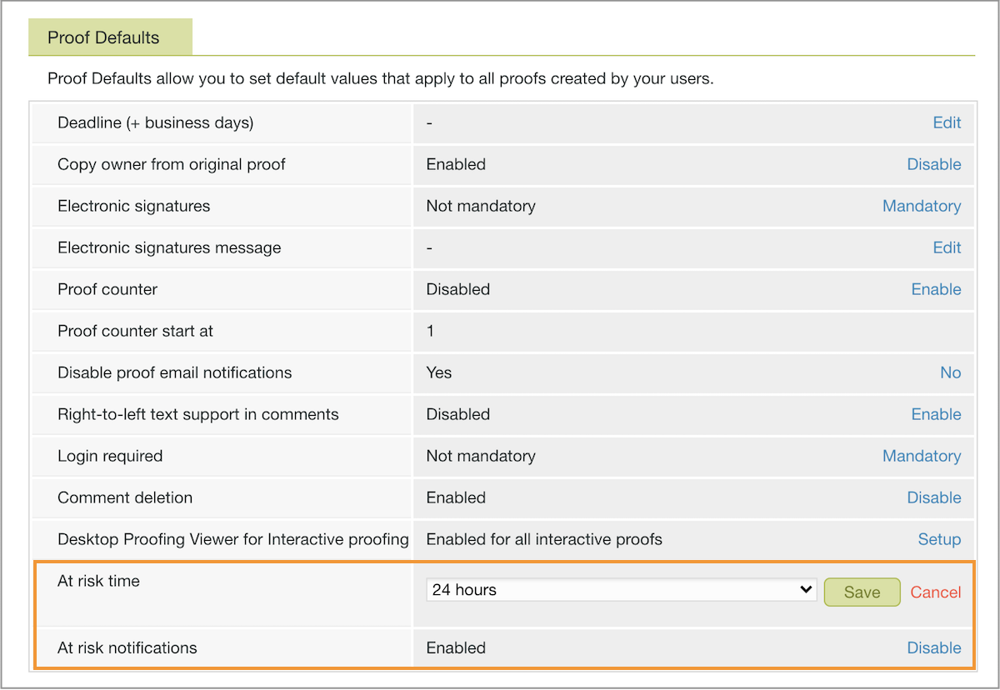

# Definir padrão em configurações de prova de risco

Você definirá as configurações para notificações de risco que [!DNL Workfront] envia. Estes são um lembrete gentil sobre o prazo de prova futuro para o proprietário da prova e aprovadores que ainda não tomaram uma decisão.

A notificação de risco é feita por padrão, uma prova é considerada &quot;em risco&quot; 24 horas antes do prazo da prova. [!DNL Workfront] A recomenda deixar essa notificação ativada com o período de 24 horas. No entanto, se o tempo de resposta de prova em sua organização for horas em vez de dias, talvez você queira encurtar isso para apenas algumas horas.

1. Selecionar **[!UICONTROL Tofing]** from [!DNL Workfront’s] [!UICONTROL Menu principal].
1. Selecionar **[!UICONTROL Configurações da conta]** na barra de navegação superior.
1. Selecione o **[!UICONTROL Configurações]** guia .
1. Vá para o [!UICONTROL Padrões de prova] seção.
1. No [!UICONTROL Em tempo de risco] , selecione **[!UICONTROL Configuração]**. Em seguida, escolha o número de horas antes de um prazo de prova para o envio da notificação.
1. Selecionar **[!UICONTROL Salvar]** para essa configuração.
1. Certifique-se de que diz [!UICONTROL Ativado] no [!UICONTROL Notificações de risco] campo. Caso contrário, clique no link para ativar a configuração.

## Sua vez

1. Faça logon no Workfront e navegue até a área Configuração . Na seção Revisar e aprovar , escolha as configurações para recipients de prova e não recipients designados.
1. Agora use o Menu principal no Workfront para ir até as configurações de prova (selecione Provas). Defina o país, o idioma e o fuso horário como padrão para todos os usuários de provas e provas.
1. Se necessário, ajuste o Tempo de notificação em risco na guia Configurações na área de configurações de prova. Fale com as equipes usando prova para decidir o que funcionará melhor para elas.

<!--
Lean More URLs
-->
