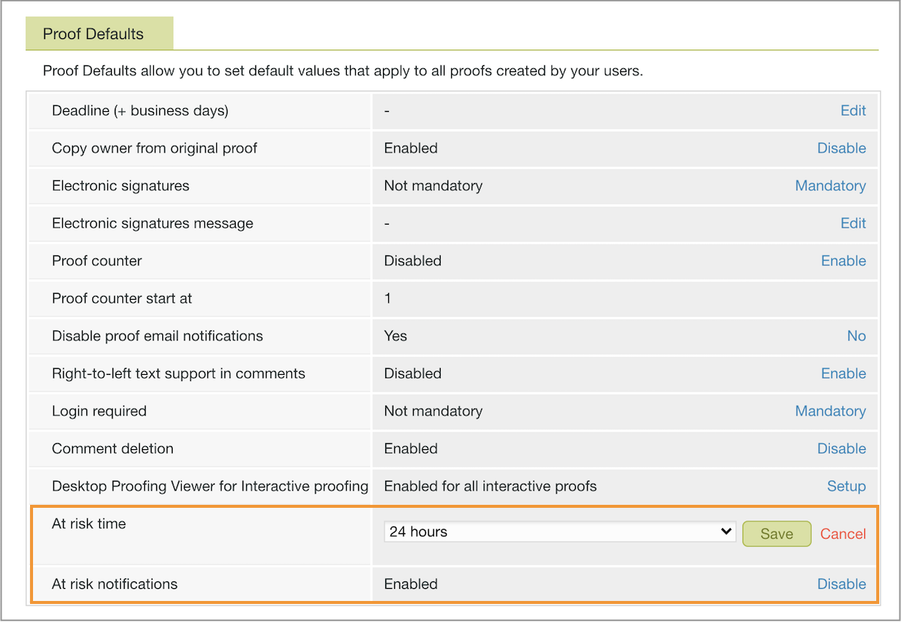

# Definir configurações padrão para provas em risco

É recomendado estabelecer configurações para as notificações de risco que o [!DNL Workfront] envia. Essas notificações são um rápido lembrete sobre um prazo de prova que se aproxima, enviado ao proprietário da prova e a aprovadores que ainda não tomaram uma decisão.

As notificações de risco estão ativadas por padrão, e uma prova é considerada “em risco” quando restam 24 horas até o prazo final. O [!DNL Workfront] recomenda deixar essa notificação ativada com o prazo de 24 horas. No entanto, se o tempo de entrega da prova na sua organização for baseado em horas em vez de dias, convém reduzir essa configuração para apenas algumas horas.

1. Selecione **[!UICONTROL Revisão]** no [!DNL Workfront’s] [!UICONTROL Menu principal].
1. Selecione **[!UICONTROL Configurações da conta]** na barra de navegação superior.
1. Selecione a guia **[!UICONTROL Configurações]**.
1. Acesse a seção [!UICONTROL Padrões de prova].
1. No campo [!UICONTROL Período de alerta], selecione **[!UICONTROL Configurar]**. Em seguida, defina quantas horas antes do prazo da prova deve ser realizado o envio da notificação.
1. **[!UICONTROL Salve]** essa configuração.
1. Certifique-se de que o campo [!UICONTROL Notificações de risco] esteja [!UICONTROL Habilitado]. Caso contrário, clique no link para habilitar a configuração.

## Sua vez

1. Faça logon no Workfront e acesse a área de Configuração. Na seção Revisão e aprovação, escolha as configurações para destinatários e não destinatários de prova designados.
1. Agora use o menu principal do Workfront para acessar as configurações de prova (selecione Revisão). Defina o país, o idioma e o fuso horário padrão que serão utilizados em todas as provas e usuários de prova.
1. Se necessário, ajuste o horário da notificação de risco na guia Configurações da área de configuração de provas. Converse com as equipes que usam provas para decidir o que funcionará melhor para elas.

<!--
Lean More URLs
-->
