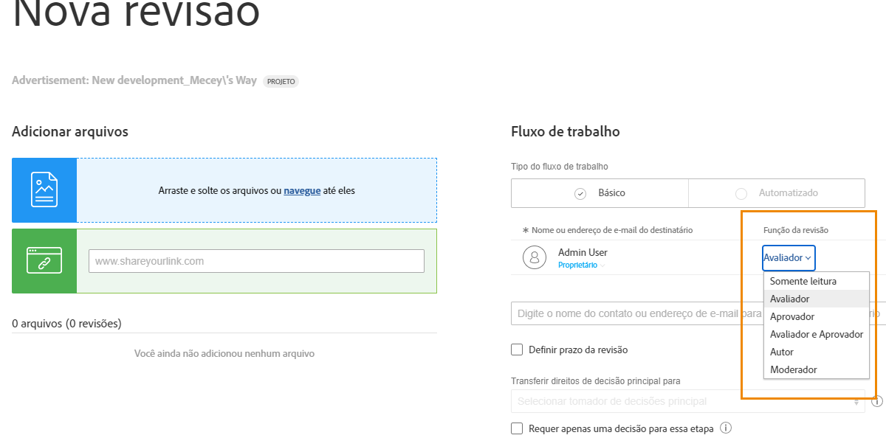
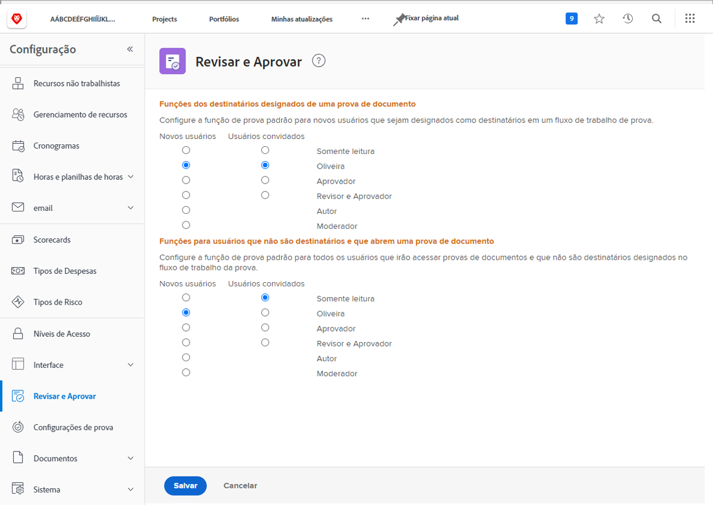

# Definir funções de prova padrão

A primeira configuração padrão a ser concluída é determinar uma função de prova padrão que será atribuída quando novos usuários forem criados ou as pessoas abrirem uma prova.

As funções de prova determinam o que um usuário pode fazer com uma prova. Basta olhar, fazer comentários, aprovar etc. [!DNL Workfront] A recomenda que os padrões de função de prova sejam definidos para todos os usuários, para agilizar e facilitar a adição de recipients às provas e a configuração de workflows.

No entanto, essa função de prova padrão pode ser alterada à medida que provas individuais são carregadas, garantindo que todos possam cumprir a função exigida por eles no processo de revisão e aprovação.

## Definir funções de prova padrão

1. Selecionar **Configuração** do [!UICONTROL Menu principal].
1. Selecionar **Revisão e aprovação** no menu esquerdo.
1. Clique no botão ao lado da função de prova padrão desejada para novos [!DNL Workfront] usuários e usuários convidados de prova para &quot;recipients designados&quot; — qualquer pessoa adicionada ao fluxo de trabalho de prova, manualmente ou por meio de um template de fluxo de trabalho.
1. Clique no botão ao lado da função de prova padrão desejada para novos [!DNL Workfront] usuários e usuários de prova de convidado para usuários &quot;não destinatários&quot;. Em geral, [!DNL Workfront] usuários que têm acesso a uma prova, mas não são uma das pessoas atribuídas ao fluxo de trabalho.
1. Salve as alterações.

Considere o que a maioria dos usuários e convidados farão quando forem adicionados a um fluxo de trabalho de prova. Esse deve ser o seu padrão.

## Práticas recomendadas

| Prática recomendada | Aqui está o porquê |
|---|---|
| Use somente leitura ou Revisor para a configuração &quot;Funções para não destinatários que abrem uma prova de documento&quot; no Workfront. | As outras opções dessa configuração exigem que seja tomada uma decisão de prova, o que pode prejudicar seu fluxo de trabalho de prova. Geralmente, as pessoas que não são adicionadas ao fluxo de trabalho de prova precisam apenas visualizar a prova ou fazer comentários, não aprovar realmente a prova, portanto, as opções Somente leitura ou Revisor são a melhor opção.    Observação: essa configuração é encontrada no Menu principal do Workfront > Configuração > Revisão e Aprovação. |
