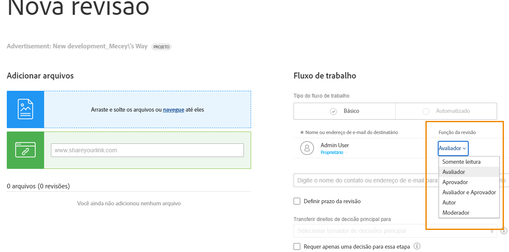
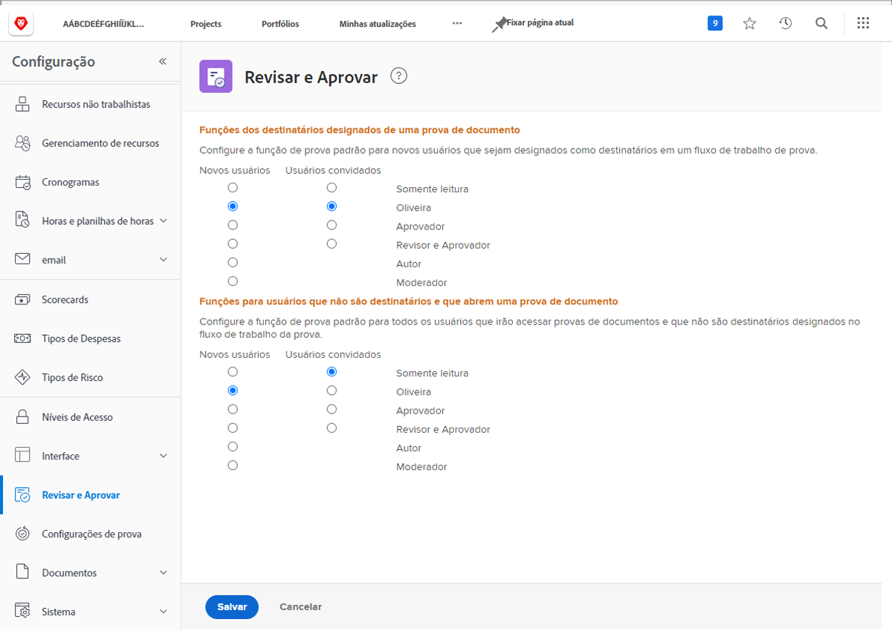

# Definir funções de prova padrão

A primeira configuração padrão a ser concluída é determinar uma função de prova padrão que será atribuída quando novos usuários forem criados ou as pessoas abrirem uma prova.

Funções de prova determinam o que um usuário pode fazer com uma prova. Basta olhá-la, fazer comentários, aprová-la, etc. O [!DNL Workfront] recomenda que os padrões de função de prova sejam definidos para todos os usuários, para tornar mais rápido e fácil adicionar recipients às provas e configurar fluxos de trabalho.

No entanto, essa função de prova padrão pode ser alterada quando for feito o upload de provas individuais, garantindo que todos possam cumprir a função exigida no processo de revisão e aprovação.

## Definir funções de prova padrão

1. Selecione **Configurar** no [!UICONTROL Menu principal].
1. Selecione **Revisão e aprovação** no menu esquerdo.
1. Clique no botão ao lado da função de prova padrão desejada para tanto para novos usuários do [!DNL Workfront] como para usuários de prova convidados, no caso dos“destinatários designados” — qualquer pessoa que seja adicionada ao fluxo de trabalho de prova, manualmente ou por meio de um modelo de fluxo de trabalho.
1. Clique no botão ao lado da função de prova padrão desejada tanto para novos usuários do [!DNL Workfront] como para usuários de prova convidados, no caso dos usuários “não destinatários”. Estes são geralmente usuários do [!DNL Workfront] que têm acesso a uma prova, mas não são uma das pessoas com atribuição no fluxo de trabalho.
1. Salve as alterações.

Pense no que a maioria dos seus usuários e convidados devem fazer quando forem adicionados a um fluxo de trabalho de revisão. Esse deve ser o seu padrão.

## Práticas recomendadas

| Prática recomendada | Saiba por quê |
|---|---|
| Use Somente leitura ou Revisor para a configuração “Funções para não destinatários que abrirem uma prova de documento” no Workfront. | Todas as outras opções dessa configuração exigem que seja tomada uma decisão da prova, o que pode atrapalhar seu fluxo de trabalho de revisão. Geralmente, as pessoas que não são adicionadas ao fluxo de trabalho da revisão só precisam visualizar a prova ou fazer comentários, não precisam aprovar a prova; portanto, as opções “Somente leitura” ou “Revisor” são a sua melhor escolha.   Observação: essa configuração fica no Menu principal do Workfront > Configuração > Revisão e Aprovação. |
