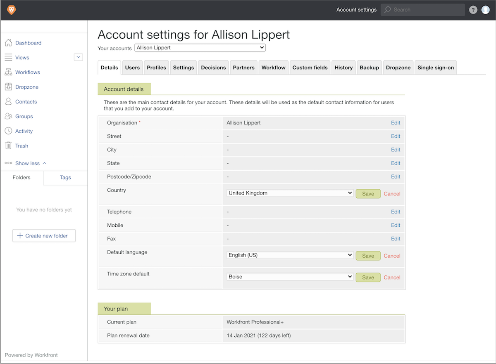

# Definir configurações padrão da conta de prova

Estabeleça configurações de conta padrão que se apliquem a todas as revisões e usuários de revisão (como configurações de país, idioma e fuso horário). Se você tiver usuários e usuárias em vários fusos horários ou países, poderá ajustar essas configurações no perfil de cada usuário ou usuária, se necessário.

1. Selecione **[!UICONTROL Revisão]** no [!DNL Workfront's] [!UICONTROL Menu principal].
1. Selecione **[!UICONTROL Configurações da conta]** na barra de navegação superior.
1. Selecione a guia **[!UICONTROL Detalhes]**.
1. Acesse o campo [!UICONTROL País] e selecione **[!UICONTROL Editar]**. Escolha como padrão o país onde a maioria dos usuários de revisão estão localizados.
1. **[!UICONTROL Salve]** essa configuração.
1. Acesse o campo [!UICONTROL Idioma padrão] e selecione **[!UICONTROL Editar]**. Escolha como padrão o idioma que a maioria dos usuários de revisão usará.
1. **[!UICONTROL Salve]** essa configuração.
1. Acesse o campo [!UICONTROL Fuso horário padrão] e selecione **[!UICONTROL Editar]**. Escolha como padrão o fuso horário utilizado pela maioria dos usuários de revisão. Este será o fuso horário reconhecido pelos fluxos de trabalho de prova que forem configurados manualmente. Isso também se aplicará a modelos de fluxo de trabalho de prova, porém, é possível definir um fuso horário diferente para cada modelo.
1. **[!UICONTROL Salve]** essa configuração.

## Práticas recomendadas

| Prática recomendada | Saiba por quê |
|---|---|
| Ajuste as configurações de back-end de revisão, para que os usuários vejam os prazos no formato de 12 horas. | Selecione a opção F j, Y, gi:a nas configurações de prova para usuários que desejam ver prazos/horas de prova em um formato AM/PM. Para regiões que usam um relógio de 12 horas, isso ajuda a deixar os prazos mais claros.    Observação: essa configuração fica no Menu principal do Workfront > Revisão > Configurações da conta > Usuários, e editando o campo Formato de data para cada usuário ou usuária. |
| Estabeleça um prazo de revisão padrão como parte das configurações do sistema. | Quando for definido um prazo padrão da prova (a data de upload + x dias úteis), se a pessoa que cria a prova se esquecer de adicionar um prazo, o Workfront aplicará automaticamente esse prazo a todas as revisões enviadas por upload.   Observação: essa configuração fica no Menu principal do Workfront > Revisão > Configurações da conta > Configurações > Padrões de prova > campo Prazo (+ dias úteis). |
| Oculte a opção de revisão de prova “Não relevante”. | Essa opção de decisão muitas vezes causa confusão entre os aprovadores, pois muitas vezes as organizações não definem quando a opção “Não relevante” deve ser usada. A opção “Não relevante” geralmente indica que a revisão não é relevante para o destinatário da revisão e que ele não precisa tomar nenhuma decisão de aprovação ou rejeição. Selecionar “Não relevante” permite que o fluxo de trabalho de revisão continue.   A opção “Não relevante” não é necessária na maioria dos fluxos de trabalho de revisão.   Observação: essa configuração fica no Menu principal do Workfront > Revisão > Configurações da conta > Decisões. |
| Não reordene as opções de decisão de revisão nas configurações de revisão. | Cada configuração de decisão de revisão contém um valor/peso específico que, se reordenado, pode causar confusão nas suas configurações de revisão. A ordem de decisão e o valor/peso são usados como acionadores do estágio de revisão e nos relatórios.   Observação: essa configuração fica no Menu principal do Workfront > Revisão > Configurações da conta > Decisões. |
| Defina os padrões do usuário para funções de revisão e alertas por email. | Essas configurações são preenchidas automaticamente quando um fluxo de trabalho de revisão é atribuído, acelerando o processo e contribuindo para a consistência entre os fluxos de trabalho de revisão.   Observação: as configurações padrão do usuário ou usuária ficam no Menu principal do Workfront > Revisão > Configurações da conta > Usuários > e selecionando o usuário ou usuária para o(a) qual deseja definir os padrões. |
