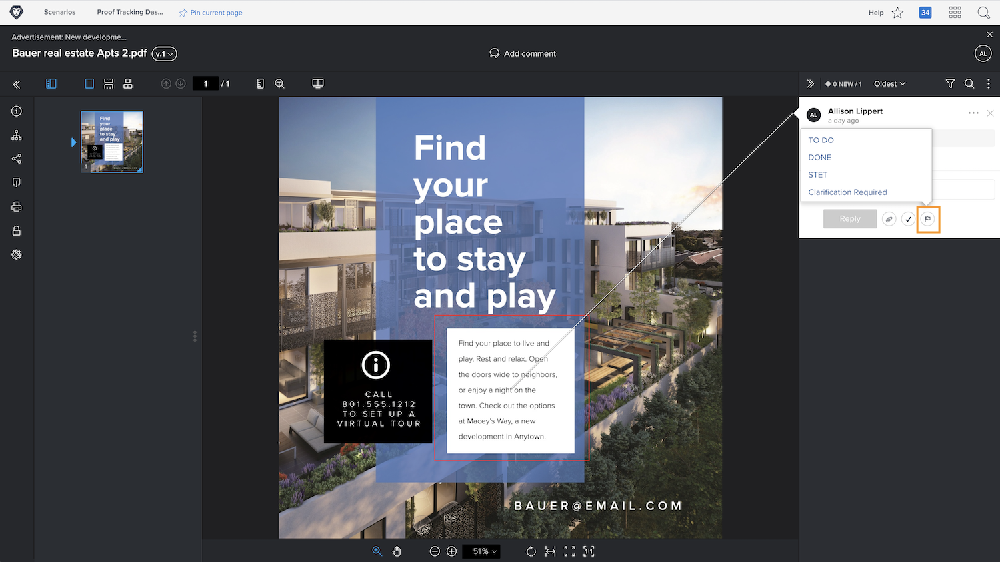
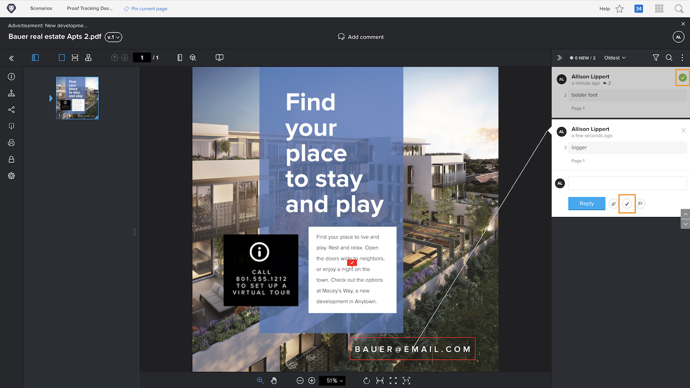

# Gerenciar comentários de prova

O [!DNL Workfront] ajuda a monitorar e gerenciar o trabalho relacionado a cada comentário em uma prova (como fazer correções no ativo), utilizando ações de comentário ou resolvendo comentários.

As ações de prova são um “sinalizador” ou “rótulo” em um comentário, e são frequentemente usadas para indicar que uma ação foi tomada ou precisa ser tomada em relação ao comentário. As ações podem ser selecionadas no ícone ou no menu “Mais” em cada comentário.

Por exemplo, você é responsável por decidir quais das correções feitas durante o processo de revisão devem realmente ser realizadas. Usando uma ação, você pode marcar os comentários relevantes para informar ao designer ou editor quais revisões fazer. Em seguida, essa pessoa pode usar outra ação para indicar que as alterações foram feitas.

![Uma imagem de uma revisão no visualizador de revisões com a ação de revisão [!UICONTROL Pendente] destacada no comentário.](assets/manage-comments-2.png)

Se as ações de comentários não estiverem disponíveis, a sua organização precisa configurá-las. Converse com o(a) admin do sistema de revisão se achar que as ações são um recurso necessário para sua organização.

O recurso “resolver comentário” é comumente usado para indicar que um comentário foi atendido de alguma maneira: uma correção foi feita ou uma pergunta foi respondida. Alguns clientes do [!DNL Workfront] “resolvem” um comentário quando este se trata de uma correção que não precisa ser feita ou é apenas um comentário que foi lido.

Para resolver o comentário, clique no ícone de marca de seleção. Isso insere uma marca de seleção verde no comentário, o que facilita a identificação de quais comentários foram revisados à medida que você examina a coluna de comentários.

Você pode filtrar a coluna de comentários por esses dois recursos, ajudando a organizar o que vê enquanto trabalha com a prova.

![Uma imagem dos filtros de comentário no visualizador de revisões com os filtros [!UICONTROL Ações] e [!UICONTROL Geral] destacados.](assets/manage-comments-3.png)

## Sua vez

>[!IMPORTANT]
>
>Não se esqueça de informar colegas de trabalho atribuídos a um fluxo de trabalho de prova que você está trabalhando com provas como parte do treinamento do Workfront.

1. Encontre uma prova que você tenha carregado no Workfront. Abra o visualizador de provas para ver os comentários feitos e respondê-los. Feche o visualizador de provas quando terminar.
1. Use a seção “Atualizações”, em “Detalhes do documento” ou no painel de resumo, para ver os comentários mais recentes em uma prova que você carregou no Workfront. Responda a um comentário.

<!--
## Learn more
* Create and manage proof comments
-->
