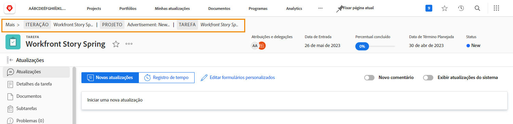

# Entenda os detalhes da revisão

## Exibir detalhes da revisão

Como alguém responsável pelo gerenciamento de revisões ou tenha a posse das revisões, você pode se aprofundar nos detalhes por trás de uma revisão por meio do painel de resumo e da página [!UICONTROL Detalhes do documento]. Comece encontrando sua revisão na seção [!UICONTROL Documentos] de um projeto, tarefa ou problema.

### Painel de resumo

Selecione uma prova na lista de documentos e clique no ícone Resumo no canto superior direito da tela.

![Uma imagem da seção [!UICONTROL Documentos] de um projeto com uma prova selecionada.](assets/document-summary-1.png)

Em seguida, clique em Visão geral para expandir a seção de visão geral.

![Uma imagem da seção [!UICONTROL Documentos] de um projeto com uma revisão selecionada e o painel de resumo expandido. O ícone do painel de resumo e o painel de resumo estão realçados.](assets/document-summary-2.png)

Em seguida, role a tela para baixo até a seção Revisão. Aqui você pode ver o proprietário da prova, o progresso, o número de comentários, o estado e o prazo.

![Uma imagem da seção [!UICONTROL Documentos] de um projeto com uma revisão selecionada e o painel de resumo expandido. O ícone do painel de resumo e o painel de resumo estão realçados.](assets/document-summary-3.png)

Observação: a seção [!UICONTROL Aprovações] no painel de resumo é para aprovações de **documentos** e **não está** vinculada ao processo de revisão e aprovação de provas. Os dois processos são separados no [!DNL Workfront].

### [!UICONTROL Detalhes do documento]

Para obter mais informações sobre a prova, clique em [!UICONTROL Detalhes do documento].

![Uma imagem da seção [!UICONTROL Documentos] de um projeto com uma prova selecionada e [!UICONTROL Detalhes do documento] destacada.](assets/document-summary-4.png)

Você será direcionado para a página [!UICONTROL Detalhes do documento] e para uma variedade de opções adicionais no painel esquerdo.

![Uma imagem da página da revisão no [!DNL  Workfront].](assets/document-details.png)

É importante observar que a capacidade de ver informações relacionadas ao processo de revisão depende das suas permissões de revisão no [!DNL Workfront].

Na página da prova, você pode acessar estas seções no menu do painel esquerdo:

* **Atualizações:** comentários feitos no visualizador de provas aparecem aqui, com uma tag “comentário de prova”. Também é possível fazer comentários no arquivo da mesma forma que você faz comentários em uma tarefa ou projeto (esses comentários não aparecem no visualizador de revisões).
* **Aprovações:** esta seção é para a aprovação de documentos, não para a aprovação de revisões. Os dois tipos de aprovação são processos separados no [!DNL Workfront] e não têm vínculos entre si. Se estiver usando fluxos de trabalho de prova para suas revisões e aprovações, você não usará esta seção.
* **Todas as versões:** acompanhe e gerencie o histórico de versões da revisão. Você pode achar mais fácil acessar essas informações no painel de resumo da lista de [!UICONTROL Documentos].
* **Formulários personalizados:** os formulários personalizados são usados em revisões para captar informações específicas da organização. Essas informações podem ser transmitidas com o arquivo para sistemas integrados de armazenamento de documentos, como o [!DNL Workfront] DAM ou Adobe Experience Manager. Os formulários personalizados são configurados pela pessoa responsável pela administração do sistema ou do grupo do [!DNL Workfront]. Converse com a sua equipe ou com os seus administradores para saber se você usará formulários personalizados nas revisões.
* **Fluxo de trabalho de revisão:** gerencie ou modifique o fluxo de trabalho atribuído à revisão. Você também pode abrir esta janela usando o link [!UICONTROL Fluxo de trabalho de provas] na prova na lista [!UICONTROL Documentos].

Vamos dar uma olhada mais de perto em duas das seções: [!UICONTROL Configurações do visualizador de provas] e [!UICONTROL Atividade de provas].

### [!UICONTROL Configurações do visualizador de provas]

Essas configurações ajudam a controlar o acesso à própria revisão.

![Uma imagem das [!UICONTROL Configurações do visualizador de revisões] da página da revisão com a opção [!UICONTROL Configurações do visualizador de revisões] realçada no menu do painel esquerdo.](assets/proofing-settings-on-details-page.png)

* **[!UICONTROL Exigir logon. Esta revisão não pode ser compartilhada com usuários convidados:]** a prova só pode ser compartilhada com pessoas que têm uma licença de revisão do [!DNL Workfront].
* **[!UICONTROL Exigir que as decisões sejam assinadas eletronicamente]:** compartilhar uma prova exige que o destinatário tenha permissões de revisão no [!DNL Workfront] e faz com que ele “assine eletronicamente” a prova inserindo sua senha de prova ao tomar uma decisão da prova. (Observação: a senha de revisão é diferente da sua senha do [!DNL Workfront]. A senha de prova não é facilmente acessível, portanto, a maioria dos destinatários não saberá essa senha). A Adobe recomenda conversar com seu consultor do [!DNL Workfront] antes de usar esse recurso.
* **[!UICONTROL À prova de bloqueio quando todas as decisões necessárias forem tomadas:]** bloqueia a revisão para quaisquer comentários, respostas, decisões etc., uma vez que cada decisão sobre a revisão tenha sido tomada. Isso bloqueia toda a versão da revisão, não apenas um estágio específico do fluxo de trabalho de revisão.
* **[!UICONTROL Permitir download do arquivo original]:** os destinatários da prova podem baixar o arquivo original da prova no visualizador de provas.
* **[!UICONTROL Permitir o compartilhamento de revisões via URL público ou código incorporado:]** os recipients da revisão podem compartilhar um link para a revisão acessível publicamente com qualquer pessoa.
* **[!UICONTROL Permitir assinatura de revisões via URL público ou código incorporado:]** qualquer pessoa que receber o URL público poderá se adicionar à revisão com seu endereço de email e nome (se não for um usuário de revisão), ou seu endereço de email e senha de revisão (se for um usuário de revisão). (Observação: a senha de revisão não é a mesma que a senha do [!DNL Workfront].)

### [!UICONTROL Atividade de revisão]

Esta página rastreia todas as atividades que ocorreram na prova, além das mensagens de email que foram enviadas em relação a ela.

![Uma imagem da seção [!UICONTROL Atividade de revisão] da página da prova com a opção [!UICONTROL Atividade de revisão] destacada no menu do painel esquerdo.](assets/proofing-activity-in-details.png)

Os marcadores de data e hora da seção **[!UICONTROL Atividade]** quando comentários e decisões foram feitos, além de quem os fez. Ele também rastreia quando os estágios do fluxo de trabalho de revisão foram iniciados, quando um recipient abriu uma prova pela primeira vez e outras informações que um gerente ou proprietário de prova deseja saber. Esses detalhes podem ser úteis quando você está tentando descobrir coisas como por que um estágio de fluxo de trabalho de provas nunca foi iniciado, por exemplo.

Os marcadores de data e hora da seção **[!UICONTROL Mensagens]** quando alertas e mensagens por email foram enviados aos recipients, quem os enviou e o conteúdo da mensagem. Isso pode ser útil na solução de problemas se alguém disser que não recebeu um email sobre uma prova. Você pode verificar se e quando um email foi enviado.

A Adobe recomenda que o gerente e o proprietário da prova se familiarizem com as informações dessas duas seções. Quando você combina essas informações com a compreensão de como ler a barra de progresso do [!UICONTROL SOCD], você pode realmente entender e gerenciar suas provas, não importa onde elas estejam no fluxo de trabalho de revisão.

Quando terminar de trabalhar na seção [!UICONTROL Detalhes do documento], use o caminho da navegação estrutural para retornar à seção [!UICONTROL Documentos] do projeto, tarefa ou problema ao qual a prova está anexada.

<!--
#### Learn more
* [!UICONTROL Document details] overview
* Add a custom form to a document
* Request document approvals
* Summary for documents overview
* View activity on a proof within [!DNL Workfront]
-->
