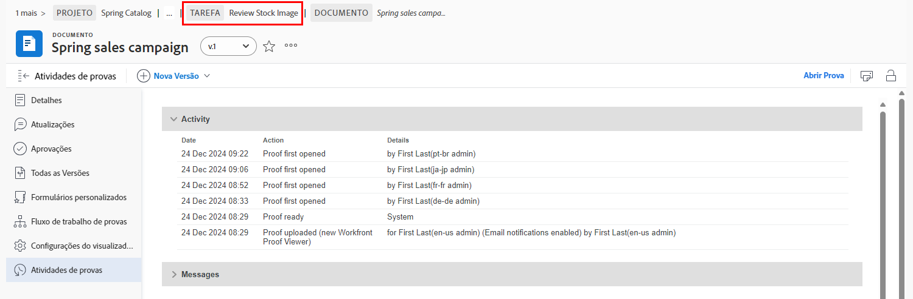

# Entender os detalhes da prova

## Exibir detalhes da prova

Como gerente ou proprietário de prova, você pode se aprofundar nos detalhes por trás de uma prova por meio do painel de resumo e do [!UICONTROL Detalhes do documento] página. Comece encontrando sua prova no [!UICONTROL Documentos] seção de um projeto, tarefa ou problema.

### Painel Resumo

O painel de resumo fornece uma visão geral de alto nível dos detalhes básicos da prova. Use o ícone para expandir o painel quando precisar e recolhê-lo quando não precisar. Você pode até passar o mouse sobre a miniatura da prova para abri-la ou baixá-la.

![Uma imagem do [!UICONTROL Documentos] seção de um projeto com uma prova selecionada e o painel de resumo expandido. O ícone do painel de resumo e o painel de resumo estão realçados.](assets/document-summary.png)

Observação: a variável [!UICONTROL Aprovações] no painel de resumo é para **documento** aprovações e **não é** vinculado ao processo de revisão e aprovação de prova sobre o qual você está aprendendo neste curso. Os dois processos são separados no [!DNL Workfront].

### [!UICONTROL Detalhes do documento]

Se precisar de mais informações sobre a prova, a variável [!UICONTROL Detalhes do documento] O link direciona você à &quot;página&quot; da prova no [!DNL Workfront].

![Uma imagem da página da prova no [!DNL  Workfront].](assets/document-details.png)

É importante observar que a capacidade de ver informações relacionadas ao processo de prova depende das suas permissões de prova no [!DNL Workfront].

Na página da prova, você pode acessar essas seções no menu do painel esquerdo:

* **Atualizações —** Os comentários feitos no visualizador de prova são exibidos aqui, com uma tag &quot;comentário de prova&quot;. Também é possível fazer comentários no arquivo, da mesma forma que você faz comentários em uma tarefa ou projeto (esses comentários não aparecem no visualizador de prova).
* **Aprovações —** Esta seção destina-se a aprovações de documentos, não de aprovações de revisões. Os dois tipos de aprovações são processos separados no [!DNL Workfront] e não se vinculam. Se estiver usando fluxos de trabalho de prova para suas revisões e aprovações, você não usará esta seção.
* **Todas as versões —** Rastreie e gerencie o histórico de versões da prova. Você pode achar mais fácil acessar essas informações no painel de resumo do [!UICONTROL Documentos] lista.
* **Forms personalizado —** Formulários personalizados são usados em provas para capturar informações específicas da organização. Essas informações podem ser passadas com o arquivo para sistemas integrados de armazenamento de documentos, como [!DNL Workfront] DAM ou [!DNL Adobe’s] AEM. Os formulários personalizados são configurados pelo seu [!DNL Workfront] administrador do sistema ou administrador de grupo. Converse com sua equipe ou com seus administradores para saber se você usará formulários personalizados em provas.
* **Fluxo de trabalho de provas —** Gerencie ou modifique o fluxo de trabalho atribuído à prova. É possível abrir essa janela usando o [!UICONTROL Fluxo de trabalho de provas] link na prova no [!UICONTROL Documentos] também. Saiba como fazer alterações no fluxo de trabalho com o vídeo Edit a proof workflow.

Vamos analisar mais detalhadamente duas das seções: [!UICONTROL Configurações do visualizador de provas] e [!UICONTROL Atividade de Prova].

### [!UICONTROL Configurações do visualizador de provas]

Essas configurações ajudam você a controlar o acesso à própria prova.

![Uma imagem do [!UICONTROL Configurações do visualizador de provas] na página da prova com o [!UICONTROL Configurações do visualizador de provas] opção realçada no menu do painel esquerdo.](assets/proofing-settings-on-details-page.png)

* **[!UICONTROL Exigir logon. Esta prova não pode ser compartilhada com usuários convidados] —** A prova só pode ser compartilhada com pessoas que tenham uma [!DNL Workfront] licença de comprovação.
* **[!UICONTROL Requer decisões assinadas eletronicamente] —** Ao compartilhar uma prova, é necessário que o destinatário tenha permissões de prova no [!DNL Workfront] e faz com que eles &quot;assinem eletronicamente&quot; a prova inserindo sua senha de prova quando tomam uma decisão de prova. (Observação: a senha de comprovação é diferente da [!DNL Workfront] senha. A senha de comprovação não é facilmente acessível, portanto, a maioria dos destinatários não saberá essa senha.) [!DNL Workfront] A recomenda conversar com o seu [!DNL Workfront] antes de usar esse recurso.
* **[!UICONTROL Bloquear prova quando todas as decisões necessárias forem tomadas]—** Isso bloqueia a prova para comentários, respostas, decisões etc. adicionais, uma vez que cada decisão sobre a prova é tomada. Isso bloqueia toda a versão de prova, não apenas um estágio específico do fluxo de trabalho de prova.
* **[!UICONTROL Permitir o download do arquivo original] —** Os destinatários de prova podem baixar o arquivo de origem original da prova no visualizador de prova (a opção está no menu do painel direito).
* **[!UICONTROL Permitir o compartilhamento da prova por meio de URL público ou código de inserção] —** Os recipients de prova podem compartilhar um link de prova acessível publicamente com qualquer pessoa.
* **[!UICONTROL Permitir assinatura da prova por meio de URL público ou código de inserção] —** Qualquer pessoa que receber o URL público poderá se adicionar à prova com seu endereço de email e nome (se não for um usuário de prova) ou seu endereço de email e senha de prova (se for um usuário de prova). (Observação: a senha de comprovação não é a mesma que uma [!DNL Workfront] senha.)

Essas mesmas configurações podem ser definidas quando o upload da prova é feito no [!UICONTROL Configurações de prova] na parte inferior da janela de upload.

![Uma imagem do [!UICONTROL Configurações de prova] na parte inferior da janela de upload.](assets/proof-settings-on-upload-page.png)

### [!UICONTROL Atividade de Prova]

Esta página rastreia todas as atividades que ocorreram na prova, além das mensagens de email que foram enviadas em relação a esta prova.

![Uma imagem do [!UICONTROL Atividade de Prova] seção da página da prova com a tag [!UICONTROL Atividade de Prova] opção realçada no menu do painel esquerdo.](assets/proofing-activity-in-details.png)

A variável [!UICONTROL Atividade] carimbos de data e hora da seção quando foram feitos comentários e decisões, além de quem os tomou. Ele também rastreia quando os estágios de fluxo de trabalho de comprovação foram iniciados, quando um recipient abriu uma prova pela primeira vez e outras informações que um gerente ou proprietário de prova desejará saber. Esses detalhes podem ser úteis quando você está tentando descobrir coisas como por que um estágio de fluxo de trabalho de prova nunca foi lançado, por exemplo.

A variável [!UICONTROL Mensagens] carimbos de data e hora da seção quando alertas de email e mensagens eram enviados aos recipients, que os enviaram e o conteúdo da mensagem. Isso pode ser útil ao solucionar problemas se alguém disser que não recebeu um email sobre uma prova. Você pode verificar se e quando um email foi enviado.

[!DNL Workfront] A recomenda que o gerente e o proprietário da prova se familiarizem com as informações nessas duas seções. Quando você combina essas informações com a compreensão de como ler as [!UICONTROL SOCD] barra de progresso, você realmente pode entender e gerenciar suas provas, não importa onde elas estejam no fluxo de trabalho de provas.

Quando terminar de trabalhar no [!UICONTROL Detalhes do documento] use a trilha de navegação estrutural para voltar para a [!UICONTROL Documentos] seção do projeto, tarefa ou problema à qual a prova está anexada.

<!--
#### Learn more
* [!UICONTROL Document details] overview
* Add a custom form to a document
* Request document approvals
* Summary for documents overview
* View activity on a proof within [!DNL Workfront]
-->
