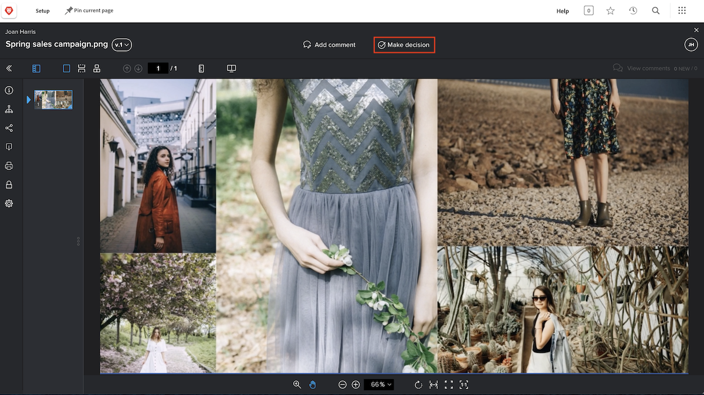

# Revisar e aprovar uma prova

Antes de começar a revisar uma prova, certifique-se de saber o que se espera de você. Qual é a sua função no fluxo de trabalho de revisão? Revisar a prova, aprová-la ou ambos?

Como revisor, seu foco pode ser analisar a prova em busca de erros gramaticais e ortográficos. As equipes de marketing e criação podem se concentrar no design do ativo e garantir que a identidade visual da corporação seja mantida. As equipes jurídicas podem garantir que a redação de um contrato de serviços não possua falhas. E gerentes de projeto podem garantir que o conteúdo revisado atenda à intenção e às metas do projeto ao qual está associado.

Você também pode ser solicitado a aprovar a prova. Aprovar uma prova seria como afirmar: “Está tudo certo com esse trabalho”. Ou talvez você tenha que dizer: “Este trabalho precisa de alterações; envie-o de volta para revisão”.

Depois de saber o que é esperado, você pode começar a revisar uma prova.

## Receber uma prova para revisar

Quando um ativo estiver pronto para revisão e aprovação, você receberá uma notificação por email.

![Uma imagem de um novo email de prova solicitando a revisão e aprovação de duas provas no [!DNL  Workfront].](assets/new-proof-emails.png)

É importante observar que este link de prova é exclusivo para você. Se compartilhar o link com alguém, quaisquer comentários e marcações que essa pessoa fizer serão exibidos com seu nome.

O email [!UICONTROL Nova prova] também contém informações essenciais sobre a prova:

* O nome da prova é a linha de assunto do email.
* A miniatura oferece uma visão rápida do que você deverá revisar.
* O número da versão informa a versão da prova que você está visualizando.
* E, o mais importante, o prazo aparece em dois lugares no email: logo acima da seção de detalhes da prova e na barra cinza do estágio do fluxo de trabalho do qual você faz parte.

Quando desejar iniciar a revisão, basta clicar no botão azul [!UICONTROL Acessar a prova] e o arquivo será aberto automaticamente no visualizador de revisão do [!DNL Workfront].

### Abrir uma prova na [!UICONTROL página inicial]

Se estiver trabalhando no [!DNL Workfront] e precisar aprovar uma prova, utilize a tarefa no widget [!UICONTROL Minhas aprovações] da [!UICONTROL Página inicial] do [!DNL Workfront].

![Uma imagem do widget [!UICONTROL Minhas aprovações] na [!UICONTROL Página inicial] do [!DNL Workfront].](assets/open-proof-from-home.png)

É importante notar que as provas aparecem na [!UICONTROL página inicial] do [!DNL Workfront] somente se você for designado(a) para aprová-las. Se você acabou de receber uma solicitação apenas para revisar a prova, elas não aparecerão na [!UICONTROL Página inicial] do [!DNL Workfront].

Clique no link [!UICONTROL Ir para a prova] para abri-la no visualizador de provas.

Dependendo da prova e dos fluxos de trabalho do projeto da sua organização, você poderá ver uma atribuição de tarefa na [!UICONTROL página inicial] do [!DNL Workfront] em vez de uma solicitação de aprovação de prova. Neste caso, você deve abrir a prova a partir da seção [!UICONTROL Documentos] da tarefa em si (veja instruções abaixo).

Você também pode encontrar provas para revisar em um painel do [!DNL Workfront] que foi criado especificamente para ajudar sua equipe ou organização a gerenciar fluxos de trabalho de prova.

### Abrir uma prova a partir de um projeto, tarefa ou problema

Se você normalmente trabalha com projetos, tarefas ou problemas no [!DNL Workfront], talvez prefira abrir a prova diretamente da seção [!DNL Documents] desse item.

![Uma imagem da seção [!UICONTROL Documentos] encontrada em uma tarefa do [!DNL  Workfront] com o link [!UICONTROL Abrir prova] realçado.](assets/open-proof-from-documents.png)

1. Clique no nome do projeto, tarefa ou problema.
2. Clique em [!UICONTROL Documentos] no menu do painel esquerdo da página do item.
3. Encontre a prova na lista [!UICONTROL Documentos].
4. Clique no link [!UICONTROL Abrir prova] para abrir o visualizador de provas.

## Como aprovar uma prova

Depois de abrir uma prova, você verá um botão **Tomar decisão** na parte superior, ao lado de **Adicionar comentário**. Caso não esteja designado como aprovador nessa prova, você não verá esse botão.

Quando desejar tomar uma decisão, clique no botão **Tomar decisão** para ver suas opções. Faça sua escolha e clique no outro botão **Tomar decisão**, localizado abaixo.

## Revisar e aprovar uma prova

Neste vídeo, você aprenderá a:

* Saiba o que se espera de você ao revisar uma prova
* Fazer um comentário em uma prova
* Use a marcação para indicar as alterações necessárias em uma prova
* Responder a um comentário de prova
* Aprovar ou rejeitar uma prova

>[!VIDEO](https://video.tv.adobe.com/v/335141/?quality=12&learn=on&enablevpops)

<!--
#### Learn more
* Create and manage proof comments
* Make decisions on a proof
* Review a static proof
* Tag users to share a proof
* Notifications for proof comments and decisions
-->

<!--
#### Guides
* Reviewing proofs in [!DNL Workfront]
* -->
