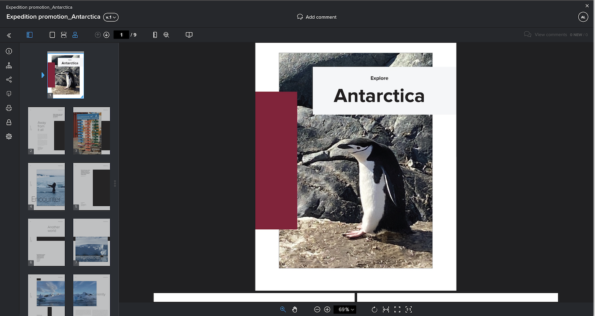
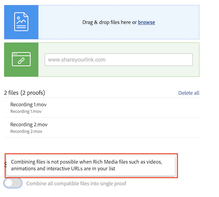

# Combine vários arquivos em uma única prova

Combinar vários arquivos em uma única revisão pode muitas vezes otimizar o processo de revisão.

A opção “combinar” é útil quando arquivos individuais estão relacionados ou quando parte de uma entrega completa e todos os arquivos precisam ser revisados pelas mesmas pessoas no mesmo prazo.

Por exemplo, a equipe criativa projetou um livreto. Quatro designers produziram as páginas e as salvaram como PDFs individuais. Se cada designer as carregasse como provas individuais, os revisores teriam quatro provas separadas para revisar. Além disso, seria mais difícil garantir que as peças do livreto se encaixassem.

Solução: peça a uma pessoa para carregar todos os PDFs e combiná-los em uma única prova no upload. Isso permite que os revisores vejam o livreto como um todo, em vez de partes desconectadas.

Para combinar provas:

1. Abra a seção [!UICONTROL Documentos] do projeto, tarefa ou problema à qual a prova deve ser anexada.
1. Clique em **Adicionar novo > Prova**.
1. Arraste e solte os arquivos na área de upload ou pesquise-os. O [!DNL Workfront] suporta a combinação de até 50 arquivos.
1. Em **Prova única**, alterne a opção para Combinar todos os arquivos compatíveis em uma única prova.
1. Insira um nome para a prova combinada. Este campo é obrigatório.
1. Se desejar, você pode alterar a ordem em que os arquivos serão combinados arrastando e soltando na lista de upload.
1. Adicione destinatários de provas, defina um prazo etc.
1. Clique em [!UICONTROL Criar prova] para concluir o upload.

![Imagem da janela [!UICONTROL Nova prova] com a lista de arquivos enviados e seções [!UICONTROL Prova única] destacadas.](assets/combine-proofs.png)

Depois que a prova for carregada, você a verá como um arquivo ZIP na guia [!UICONTROL Documentos].

Nada mais é necessário para visualizar o arquivo combinado. Basta clicar em [!UICONTROL Abrir prova] como de costume e a prova é aberta no visualizador de provas.

## E quanto à combinação de arquivos de vídeo?

Desculpe, não é possível combinar arquivos quando há arquivos de mídia avançada, como vídeos, animações e URLs interativos, em sua lista.

## Sua vez

>[!IMPORTANT]
>
>Não se esqueça de lembrar aos colegas de trabalho que você está enviando a eles uma prova como parte do treinamento do Workfront.

Localizar três ou quatro arquivos (PDF, arquivo de texto etc.) no computador.

1. Abra um projeto, tarefa ou problema que você está usando para um exercício prático no Workfront.
1. Faça upload dos arquivos, combinando-os em uma única prova.
1. Ajuste a ordem dos arquivos movendo o último da lista para a primeira posição da lista.
1. Atribua o fluxo de trabalho de sua escolha (básico ou automatizado) e conclua o upload.

<!--
##Learn more
* Create a multi-page proof
-->
