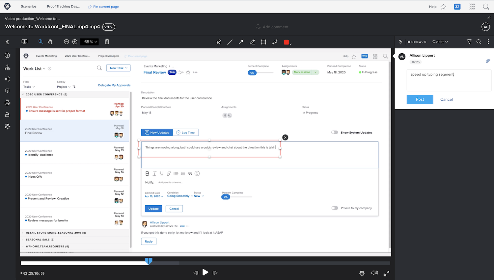

# Fazer upload de uma prova de vídeo

Os recursos de revisão do [!DNL Workfront’s] não são apenas para arquivos estáticos como PDFs, planilhas ou imagens. O [!DNL Workfront] é compatível com mais de 150 tipos de arquivos, incluindo capturas de vídeo e da web de até 4 GB.

Lembre-se de que arquivos maiores demoram mais para serem carregados. Certifique-se de que sua conexão com a Internet esteja estável antes de fazer um upload grande, pois uma interrupção poderá encerrar o processo de upload.

<!-- For a complete list of uploadable file types, see the article, Supported proofing file types. -->

O visualizador de provas do [!DNL Workfront’s] é o local ideal para revisar e aprovar arquivos de vídeo. Os destinatários da prova podem reproduzir o vídeo diretamente no visualizador de prova. Os comentários têm um carimbo de data/hora, para que você saiba exatamente a que parte do vídeo o comentário se refere. Os destinatários da prova podem até mesmo usar as ferramentas de marcação e desenhar diretamente no vídeo pausado.

Alguns dos formatos de vídeo compatíveis são: MOV, MP4 e H.264. <!-- Check the supported file types list to make sure the video type you use is compatible with Workfront’s proofing features.-->

Fazer upload de um vídeo no [!DNL Workfront] envolve as mesmas etapas do upload de um arquivo estático.

* Abra o projeto, tarefa ou problema para o qual o vídeo deve ser enviado.
* Selecione [!UICONTROL **Documentos**] no menu do painel esquerdo.
* No botão [!UICONTROL **Adicionar novo**], selecione [!UICONTROL **Prova**].
* Arraste e solte o arquivo de vídeo na área de upload ou use o recurso de navegação.
* Atribua um fluxo de trabalho básico ou automatizado.
* Defina um prazo.
* Clique em [!UICONTROL **Criar prova**] para terminar.

## Sua vez

>[!IMPORTANT]
>
>Não se esqueça de informar colegas de trabalho que você está enviando-lhes uma prova como parte do treinamento do Workfront.

Se tiver um arquivo de vídeo disponível, carregue-o para um projeto, tarefa ou problema prático no Workfront. Aplique um fluxo de trabalho básico ou automatizado semelhante ao que você normalmente usa ou aplique o fluxo de trabalho real, se já souber qual é.

