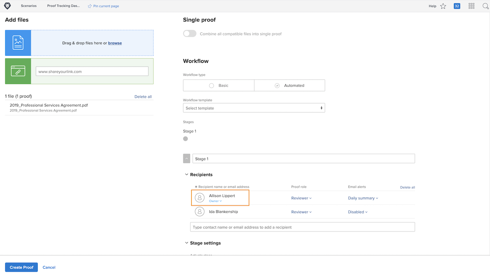

# Faça upload de uma prova com um fluxo de trabalho automatizado

Neste vídeo, você aprenderá:

* Quando um fluxo de trabalho de prova automatizado pode ser usado
* Como aplicar um fluxo de trabalho usando um modelo de prova
* Como configurar um fluxo de trabalho automatizado do zero

>[!VIDEO](https://video.tv.adobe.com/v/3453015/?quality=12&learn=on&enablevpops=1&captions=por_br)

## Configurações adicionais de fluxo de trabalho de prova

As configurações na parte inferior da janela de upload de prova são opcionais, portanto, verifique com a organização se você vai usá-las e como vai usá-las.

![Imagem da janela [!UICONTROL Nova Prova] com as [!UICONTROL Configurações de estágio] destacadas.](assets/additional-proof-workflow-settings.png)

* **[!UICONTROL Bloquear estágio]:** Evita que as pessoas neste estágio do fluxo de trabalho façam comentários ou alterem decisões após a conclusão do estágio do fluxo de trabalho.
* **[!UICONTROL Transferir direitos de decisão primários para]:** Acelere o processo de revisão designando um tomador de decisão principal. Quando definido, o [!DNL Workfront] reconhece a decisão da prova desta pessoa como A decisão. Depois que essa pessoa toma sua decisão, o estágio termina e nenhuma outra decisão é necessária.
* **[!UICONTROL Exigir apenas uma decisão para este estágio]:** Outra forma de simplificar o processo de prova é exigir apenas uma decisão sobre a prova. Com essa opção ativada, não importa quantos aprovadores você tenha nesse estágio, assim que algum deles tomar uma decisão, o estágio será concluído.
* **[!UICONTROL Tornar este estágio privado]:** Por padrão, os comentários nas provas ficam visíveis para todos em todos os estágios. Evite que os destinatários das provas em outros estágios vejam os comentários feitos durante este estágio clicando na caixa.

Na parte inferior da janela de upload da prova há diversas configurações de prova que afetam a segurança da prova, como exigir logon para visualizá-la.

<!--
Learn more about these in the Proof settings section of the Configure a proof article.
-->

![Imagem da seção [!UICONTROL Configurações da prova] da janela de upload de prova.](assets/additional-proof-workflow-settings-2.png)

<!--
### Learn more
* Automated workflow overview
* Automated workflow stages overview
-->

<!--
### Guides
* Plan an advanced workflow worksheet
-->

## Por que você está no fluxo de trabalho da prova?

Você notará que está na lista de recipients da prova porque é você que faz o upload da prova. Isso também torna você proprietário da prova, o que lhe dá direitos de edição sobre ela, permitindo alterar as configurações do fluxo de trabalho ou fazer upload de uma nova versão, entre outras coisas.

Se você estiver apenas fazendo upload da prova, mas outra pessoa gerenciará o fluxo de trabalho, você poderá alterar o proprietário da prova clicando no link [!UICONTROL Proprietário] e inserindo o nome da pessoa. Isso é recomendado se alguém que não seja o remetente original estiver fazendo upload de uma versão.

## Sua vez

>[!IMPORTANT]
>
>Não se esqueça de avisar colegas de trabalho que você está enviando-lhes uma prova como parte do treinamento do Workfront.

Faça upload de uma prova com um fluxo de trabalho avançado. Se a organização já possui modelos de prova configurados, selecione aquele que sua equipe usa e faça alguns ajustes.

* Ajuste os alertas de email para que ninguém seja notificado quando houver atividade na prova.
* O primeiro estágio deve ter dois revisores/aprovadores.
* O segundo estágio deve ter apenas um revisor/aprovador.

Se a organização ainda não tiver criado modelos de prova, configure um fluxo de trabalho em duas etapas do zero.

* Atribua você e seu colega de trabalho favorito ao primeiro estágio.
* Faça com que o prazo do primeiro estágio seja de um após a criação da prova.
* Atribua outro colega de trabalho favorito para o segundo estágio.
* Faça o estágio começar quando o prazo do primeiro estágio tiver expirado.
* Dê à pessoa neste estágio dois dias para concluir a revisão, mas ela deve ser concluída até o meio-dia.

